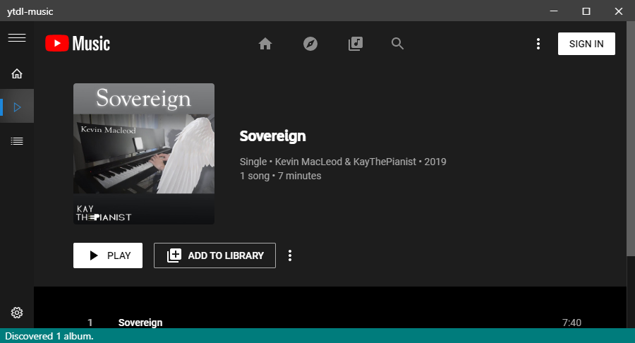
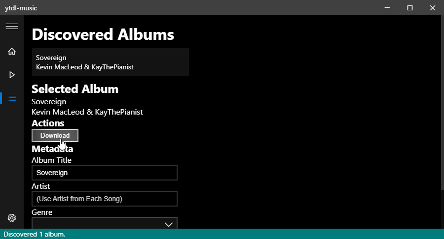

# ytdl-music
An electron frontend for `ytdl-core` and `ffmpeg` for YouTube Music.

- Downloads Songs
    - Does not rip the audio from Music Video
- Embeds Song Number within Album
- Embeds Album Artist
- Embeds Album Cover
- Embeds Song Release Date
- Embeds Genre
- Converts to `.mp3` for convenience

## Usage
1. Download and install the `.exe` in the GitHub releases section
2. Navigate to the page in the YouTube Music tab
    - Note that the "discovered albums" count increases in the bottom left hand corner
3. Select the album in the "Discovered Albums" tab
4. Click on Download

## Screenshots

## Help
For support, try [my discord server](https://discordapp.com/invite/wHgdmf4).

## Licence
This software package is licenced under the MIT licence.
